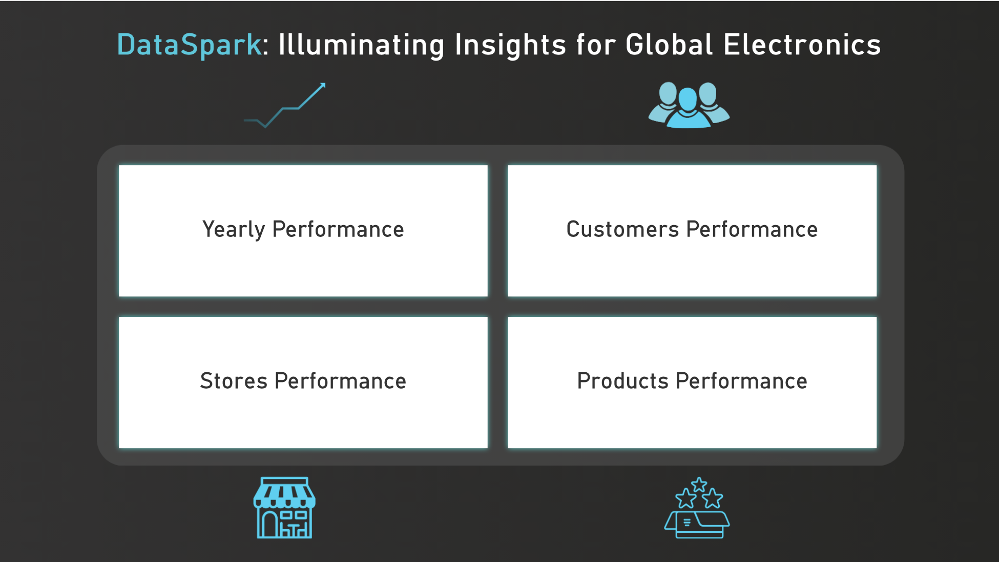
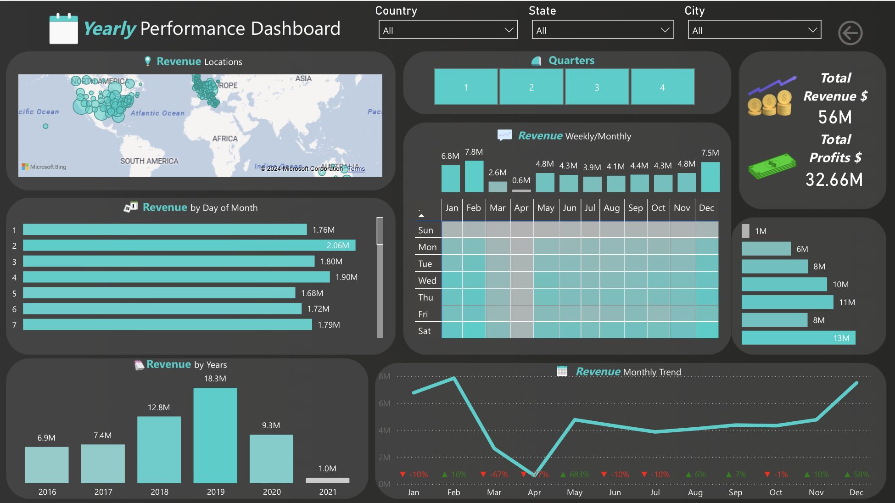
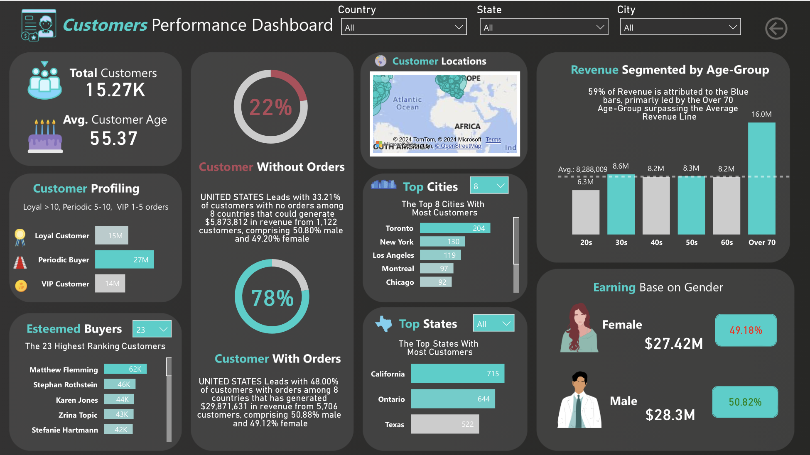
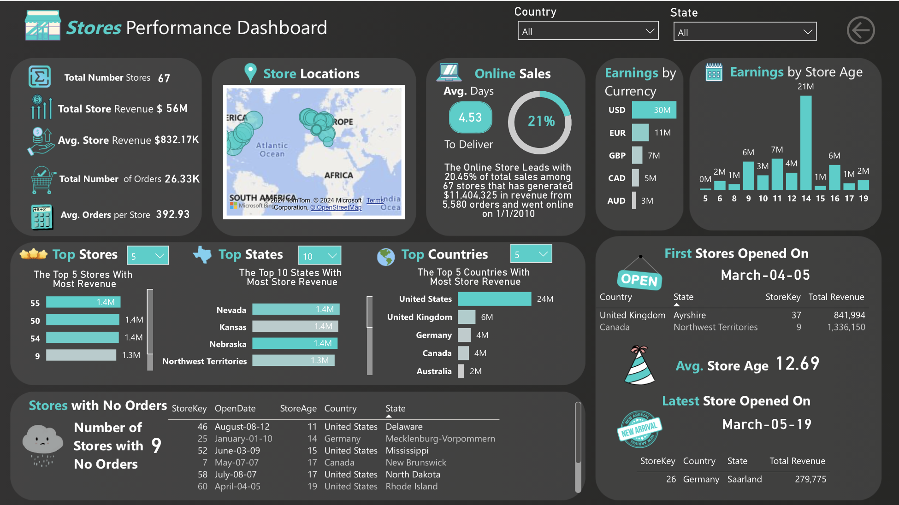
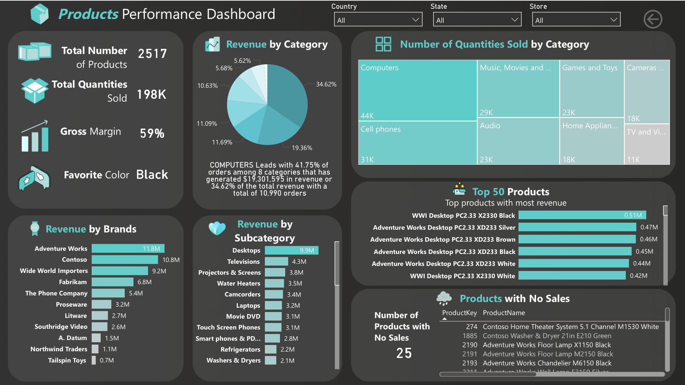

# DataSpark: Illuminating Insights for Global Electronics

### Problem Statement:

As part of Global Electronics' data analytics team, the goal is to conduct a comprehensive Exploratory Data Analysis (EDA) to uncover valuable insights from the company’s data. The goal is to provide actionable recommendations that can enhance customer satisfaction, optimize operations, and drive overall business growth.
Global Electronics, a leading retailer of consumer electronics, has provided you with several datasets containing information about their customers, products, sales, stores, and currency exchange rates. The company seeks to leverage this data to better understand their business and identify areas for improvement.

### Business Use Cases:

By analyzing Global Electronics' customer, product, sales, and store data, one can aim to identify key insights that will enhance marketing strategies, optimize inventory management, and improve sales forecasting. This will help tailor marketing campaigns, develop better products, plan effective promotions, and decide on store expansions and optimizations. Additionally, understanding the impact of currency exchange rates on sales will allow for better international pricing strategies. Overall, these insights will help Global Electronics increase customer satisfaction and drive business growth.

### Tools Used:

- Jupyter Notebook and Pycharm - IDE
- Python, Pandas, Matplotlib, Seaborn - Data cleaning, exploratory data analysis
- My SQL - Database to store and retrieve cleaned data 
- Power BI - Visualization 

### Data Sources:

link: https://www.kaggle.com/datasets/bhavikjikadara/global-electronics-retailers
Contains sales data from 1/1/2016 to 2/20/2021

1. Customer data (customers.csv): Contains information about customers such gender, D.O.B, and demographics, used for analyzing customer behavior and segmentation.
2. Sales data (sales.csv): Includes records of transactions, such as number of sales, product ID, it's quantities, order date, delivery date, store ID, and currency essential for understanding sales patterns and performance.
3. Products data (products.csv): Lists product details including IDs, names, categories, subcategory, unit prices, unit costs helping to analyze product performance and trends.
4. Stores data (stores.csv): Provides information on store locations, IDs, and attributes, useful for examining geographic sales performance and store-related analysis.
5. Currency exchange rates data (exchangerates.csv): Contains historical exchange rates between different currencies, crucial for analyzing sales and financial data in a global context.

### Approach:

#### Data Cleaning and Preparation

Checking for missing values and handle them appropriately.
Converting data types where necessary (e.g., dates, numerical values).
Merging datasets where necessary for analysis (e.g., linking sales data with product and customer data).

#### Load Data

Inserting the preprocessed data into an SQL database by creating relevant tables for each data source.

#### Power BI Visualization

 Connecting SQL to Power BI/Tableau, import the data, and create interactive dashboards.
 
#### Develop SQL and Dax Queries

Formulating and executing SQL and Dax queries to extract key insights from the data.

### Analysis Steps:

#### Customer Analysis

Demographic Distribution: Analyze the distribution of customers based on gender, age (calculated from birthday), location (city, state, country, continent).
Purchase Patterns: Identify purchasing patterns such as average order value, frequency of purchases, and preferred products.
Segmentation: Segment customers based on demographics and purchasing behavior to identify key customer groups.

#### Sales Analysis

Overall Sales Performance: Analyze total sales over time, identifying trends and seasonality
Sales by Product: Evaluate which products are the top performers in terms of quantity sold and revenue generated.
Sales by Store: Assess the performance of different stores based on sales data.
Sales by Currency: Examine how different currencies impact sales figures, considering exchange rates.

#### Product Analysis
Product Popularity: Identify the most and least popular products based on sales data.
Profitability Analysis: Calculate profit margins for products by comparing unit cost and unit price.
Category Analysis: Analyze sales performance across different product categories and subcategories.

#### Store Analysis
Store Performance: Evaluate store performance based on sales, size (square meters), and operational data (open date).
Geographical Analysis: Analyze sales by store location to identify high-performing regions.

### Results/Findings:

The analysis results are summarized as follows

1. Gender and country wise: There is no notable variation in customer distribution across different gender categories. However, the United States has the highest number of customers compared to other countries.
2. City wise: It is evident that several cities in the United States rank among the top ten cities with the highest number of customers. Notably, Toronto leads the list, followed by Montreal and Calgary, indicating a significant interest in our products within these Canadian cities as well.
3. State wise: Analysis also shows strong customer bases in major U.S. states, as well as significant interest from Canada and Germany. This provides valuable insights into market concentration and potential areas for targeted engagement and expansion.
4. Customers with No Orders: There are 3379 customers with no orders that could generate around an additional revenue of 15 million USD with targeted campaigns.
5. Age wise: The analysis reveals that the majority of customers are aged 60 and above. This demographic trend suggests a significant interest and engagement from older adults.
6. Frequency of customer visits: Most customer visits around 5 to 10 , while the visitors between 1 to 5 and >10 are split evenly. Based on customers engagement levels, we can create targeted marketing campaigns that resonate with different segments, thereby enhancing customer engagement and optimizing advertising efforts.
7. Currency wise : We can infer that most customers use USD, with significant numbers also using EUR and GBP indicating their region as well. Also, there is notable interest from Canadian and Australian markets, indicating a diverse international customer base. In regard to exchange rates, there is indication that changes in exchange rates for AUD, CAD, EUR, and GBP have minimal to no effect on the revenue in USD.
8. Category and subcategory wise : Computers lead this category with 41.75% of orders numbering 10,990 among 8 categories and has generated 19 million USD or 36.62 %. The subcategory Desktops lead the subcategory as well with 9.9 million USD in revenue.
9. Brand wise: Adventure Works, Contoso, and Wide World Importers lead the brands section, making more than 5 million USD each.
10. Product wise: The top product sold was WWI Desktop PC.33 X2330 Black selling 550 quantities and making around .51 million USD. This is followed by desktop products from Adventure works as well in the top 5 making around 0.40 million USD each.
11. Store Wise: The Online Store leads with 20.45% of total sales among 67 stores and has generated around 11 million USD.
12. Store age and size: There is no co-relation between the revenue and store's age and store's size.
13. Stores with No orders: There are 9 stores with no orders, these stores could either include targeted campaigns or be closed to focus more on online sales as it spearheads the sales.
14. Time analysis:  From 2016 to 2019, the sales revenue exhibited a consistent upward trend. During this period, the revenue increased annually, reflecting positive business performance and successful market strategies. In 2020, there was a notable decline in sales revenue. The decrease could be associated with  economic downturns, or supply chain disruptions due to the Covid-19 pandemic. For the year 2021, revenue data is only available up to February. However, the early data for 2021 suggests that the revenue challenges have continued into the new year. Further, it can be infered from all the years that the lowest performing month is April with the top 3 being December, January, and February.

## Power BI Reports

